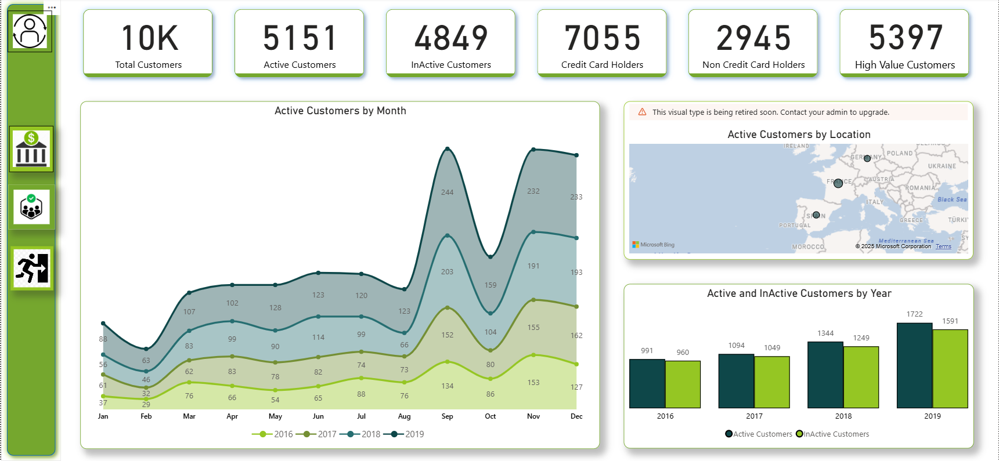
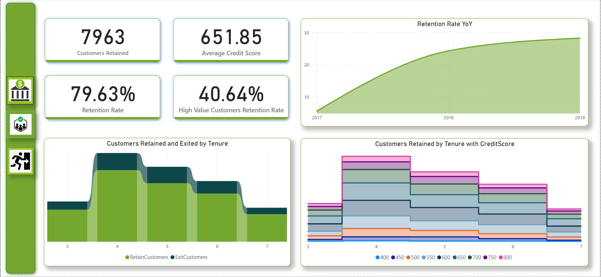
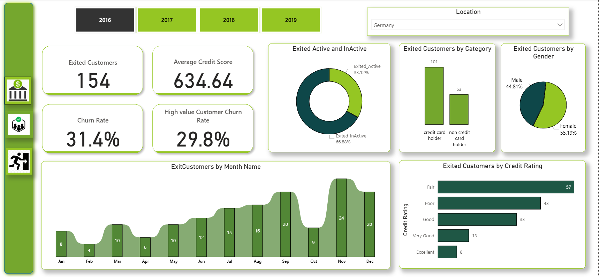

# Bank Customer Churn & Retention Analysis Dashboard

**Description**

This dashboard focuses on analyzing customer churn, retention behavior, and credit risk patterns in a banking domain using interactive dashboards. The analysis helps identify key drivers of customer exits, retention trends over time, high-value customer behavior, and the impact of credit scores, tenure, demographics, and card ownership on churn. The dashboard enables stakeholders to make data-driven decisions to improve customer retention and business performance.

**Tech Stack**

1. **Power BI** – Data modeling, DAX measures, interactive dashboards.
2. **DAX** – KPI calculations (Churn Rate, Retention Rate, YoY trends).
3. **Power Query** – Data cleaning, transformation, and enrichment.
4. **Excel / CSV** – Source data handling and preprocessing.
5. **Data Visualization** – KPI cards, line charts, bar charts, donut charts, maps, slicers.

**Data Source**

Banking customer dataset containing customer demographics, account details, credit scores, tenure, card ownership, activity status, and exit information.
Data represents multiple years (2016–2019) to support trend and YoY analysis.
Dataset is anonymized and used solely for analytical and learning purposes.

**Features / Highlights**

* Customer Overview - Total customers, active vs inactive customers, Credit card holders vs non-credit card holders, High-value customer identification.
* Retention & Churn Analysis - Overall retention rate and churn rate, High-value customer retention and churn metrics, Year-over-Year retention trend analysis.
* Behavioral Insights - Customer activity trends by month and year, Exit patterns by tenure, Retained vs exited customers across different tenure ranges.
* Credit Risk Analysis - Average credit score tracking, Churn distribution by credit rating (Excellent → Poor), Retention analysis segmented by credit score bands.
* Demographic & Category Insights - Exited customers by gender, Exits by credit card ownership category, Active and inactive exit comparison.
* Interactive Capabilities - Year-wise and location-based slicers, Drill-down enabled visuals for deeper analysis, Dynamic KPIs responding to filters.

**Business Insights**

* Customer Churn Rate: About 20% customers have exited/closed their bank accounts in the past years.
* Around 64% of the exited customers had inactive accounts when then have closed their accounts.
* Germany has the rightest churn rate among others which accounts to 32.4% and nearly 30% of them were high-value customers.
* Approximately 30% of the exited customers don't hold an credit card.
* Average credit score of the exited customers accounts to 645.35.
* An average of 55% of the exited customers who have closed their account had a tenure period between 4-5 years.

**Screenshots**

